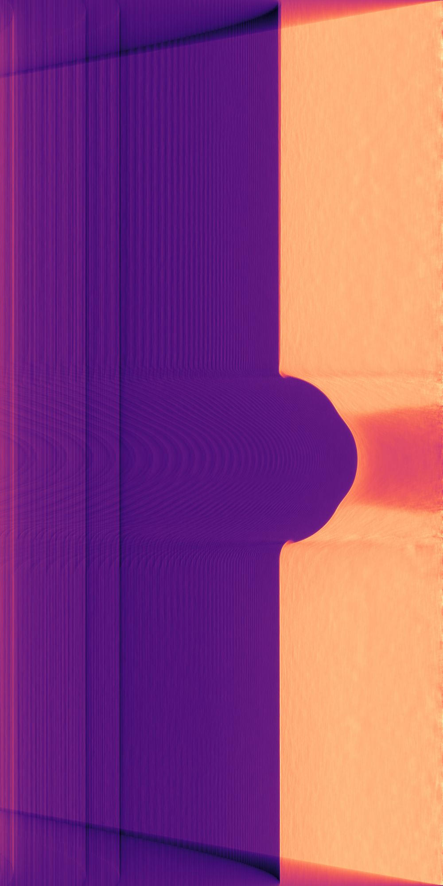

<!-- PROJECT SHIELDS -->

[![MIT License][license-shield]][license-url]

<!-- PROJECT LOGO -->
 

  

  <h3 align="center">AXITOM</h3>

  

    Tomographic reconstruction of axisymmetric fields acquired by a cone beam
     
    <a href="https://axitom.readthedocs.io/en/latest/"><strong>Explore the docs »</strong></a>
     
  

<!-- ABOUT THE PROJECT -->
About The Project
-----------------
This python package provides tools for axis-symmetric cone-beam computed tomography. A Feldkamp David Kress algorithm performs the reconstruction
which have been adapted such that is exploits the axis-symmetric nature of the tomogram.

This toolkit has a highly specialised usage, and there are plenty of more general and excellent frameworks for tomographic reconstruction, such as:
 * [TomoPy](https://github.com/tomopy/tomopy) (General computed tomography, cone and parallel beam geometry)
 * [PyAbel](https://github.com/PyAbel/PyAbel) (Computed tomography based on the inverse Abel transform, parallel beam geometry)
 
 This project aims at providing a simple, accessible toolkit for forward-projection and reconstruction of 
 axis-symmetric tomograms based on a conical beam geometry.

### Built With
This project is heavily based on the following packages:
* [Numpy](https://numpy.org/)
* [Scipy](https://www.scipy.org/)
* [Scikit-image](https://scikit-image.org/)
* [Matplotlib](https://matplotlib.org/)

<!-- GETTING STARTED -->
Getting Started
---------------
To get a local copy up and running follow these steps.

### Clone the repo:

These instructions will get you a copy of the project up and running on your 
local machine for development and testing purposes.

Prerequisites:

    This toolkit is tested on Python 3.7

Installing:

Clone this repo to your preferred location

    $ git init
    $ git clone https://github.com/PolymerGuy/axitom.git
    
We recommend that you always use virtual environments, either by virtualenv or by Conda env
    
    $ python -m venv env
    $ source ./env/bin/activate #On Linux and Mac OS
    $ env\Scripts\activate.bat #On Windows
    $ pip install -r requirements.txt

You can now run an example::
    
    $ python <path_to_axitom>/examples/comparison_to_Nikon.py

### Run the tests
The tests should always be launched to check your installation.
These tests are integration and unit tests.

If you cloned the repo, you have to call nosetests from within the folder

    $ pytest

Example
-------
Let us now go through the necessary steps for doing a reconstruction of a tomogram based on a single image.
First, we need to import the tools

    import axitom as tom
    from scipy.ndimage.filters import median_filter

Assuming that the example data from the repo is located in the example_data folder, we can make a config object
from the .xtekct file

    config = tom.config_from_xtekct("./example_data/R02_01.xtekct")

We now import the radiogram

     radiogram = tom.read_image(r"./example_data/R02_01.tif, flat_corrected=True)

and we remove the top and bottom of the image. This is necessary in this example, as the fixtures will interfere with
the algorithm used to find the centre of rotation

     radiogram[:250, :] = 0.95
     radiogram[1800:, :] = 0.95

As we will use a single radiogram only in this reconstruction, we will reduce the noise content of the radiogram by
employing a median filter. Using such a filter works fine since the density gradients within the specimen are relatively small.
You may here choose any filter of your liking.

     radiogram = median_filter(radiogram, size=20)

Now, the axis of rotation has to be determined. The axis of rotation is found by first binarizing of the image into object and background,
and subsequently determining the centre of gravity of the object

     _, center_offset = tom.object_center_of_rotation(radiogram, config, background_internsity=0.9)

The config object has to be updated with the correct values

     config.center_of_rot_y = center_offset
     config.update_internals()

We are now ready to initiate the reconstruction

     tomo = tom.fdk(radiogram, config)

The results can then be visualized

   plt.title("Radial slice")
   plt.imshow(tomo.transpose(), cmap=plt.cm.magma)
   

<!-- CONTRIBUTING -->
Contributing
------------

Contributions are what makes the open-source community such a fantastic place to learn, inspire, and create. Any contributions you make are **greatly appreciated**.

1. Fork the Project
2. Create your Feature Branch (`git checkout -b feature/AmazingFeature`)
3. Commit your Changes (`git commit -m 'Add some AmazingFeature`)
4. Push to the Branch (`git push origin feature/AmazingFeature`)
5. Open a Pull Request

<!-- LICENSE -->
License
-------

Distributed under the MIT License. See `LICENSE` for more information.

<!-- CONTACT -->
Contact
-------

Sindre Nordmark Olufsen (PolymerGuy) - sindre.n.olufsen@ntnu.no

<!-- ACKNOWLEDGEMENTS -->
Acknowledgements
----------------
We are in great debt to the open-source community and all the contributors the projects on which this toolkit is based.

<!-- MARKDOWN LINKS & IMAGES -->
[license-shield]: https://img.shields.io/badge/license-MIT-blue.svg?style=flat-square
[license-url]: https://choosealicense.com/licenses/mit

