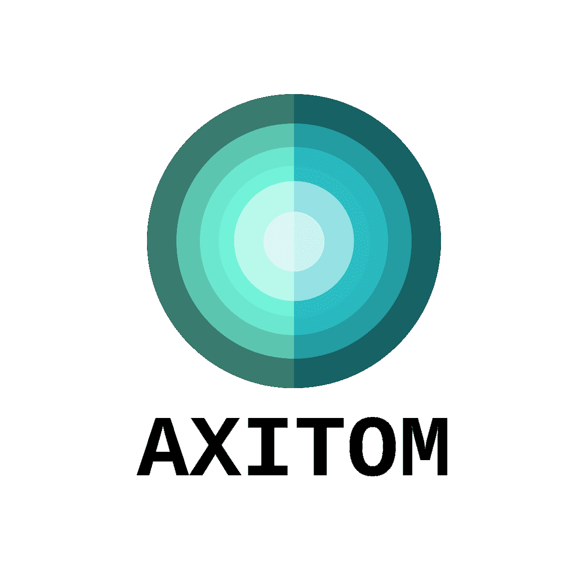

<!-- PROJECT SHIELDS -->

[![MIT License][license-shield]][license-url]

<!-- PROJECT LOGO -->
 

  

  <h3 align="center">AXITOM</h3>

  

    Tomographic reconstruction of axisymmetric fields acquired by a cone beam geometry
     
    <a href="https://axitom.readthedocs.io/en/latest/"><strong>Explore the docs »</strong></a>
     
     
    <a href="https://github.com/othneildrew/Best-README-Template">View Demo</a>
    ·
    <a href="https://github.com/othneildrew/Best-README-Template/issues">Report Bug</a>
    ·
    <a href="https://github.com/othneildrew/Best-README-Template/issues">Request Feature</a>
  

<!-- ABOUT THE PROJECT -->
## About The Project
This python package provides tools for axis-symmetric cone beam computed tomography. The reconstruction is performed by a Feldkamp David Kress algorihtm
which have been adapted such that is exploits the axis-symmetric nature of the the tomogram.

There are plenty of excellent frameworks for tomographic reconstruction, such as:
 * [TomoPy](https://github.com/tomopy/tomopy) (General computed tomography, cone and parallel beam geometry)
 * [PyAbel](https://github.com/PyAbel/PyAbel) (Computed tomography based on the inverse Abel transform, parallel beam geometry)
 
 However, this project aims at providing a simple an accessible tool-kit for forward projection and reconstruction of 
 axis-symmetric tomograms based on a conical beam geometry.

### Built With
This section should list any major frameworks that you built your project using. Leave any add-ons/plugins for the acknowledgements section. Here are a few examples.
* [Numpy](https://getbootstrap.com)
* [Scipy](https://jquery.com)
* [Scikit-image](https://laravel.com)
* [Matplotlib](https://laravel.com)

<!-- GETTING STARTED -->
## Getting Started

This is an example of how you may give instructions on setting up your project locally.
To get a local copy up and running follow these simple example steps.

### Installation

In order to get started with AXITOM, you need to install it on your computer.
There are two main ways to to this:

*   You can install it via a package manager like PIP or Conda
*   You can  clone the repo

Installing via a package manager:
----------------------------------
Prerequisites:
    This toolkit is tested on Python 2.7x and Python 3.7

On the command line, check if python is available::

    $ python --version

If this command does not return the version of you python installation,
you need to fix this first.

If everything seems to work, you install the package in your global python 
environment (Not recommend) via pip:

    $ pip install axitom

and you are good to go!

We recommend that you always use virtual environments by virtualenv or by Conda env.

    $ cd /path/to/your/project
    $ python -m virtualenv env
    $ source ./env/bin/activate #On Linux and Mac OS
    $ env\Scripts\activate.bat #On Windows
    $ pip install axitom

By cloning the repo:
---------------------

These instructions will get you a copy of the project up and running on your 
local machine for development and testing purposes.

Prerequisites:
    This toolkit is tested on Python 2.7x and Python 3.7

Installing:
Start to clone this repo to your preferred location

    $ git init
    $ git clone https://github.com/PolymerGuy/axitom.git
    
We recommend that you always use virtual environments, either by virtualenv or by Conda env
    
    $ python -m virtualenv env
    $ source ./env/bin/activate #On Linux and Mac OS
    $ env\Scripts\activate.bat #On Windows
    $ pip install -r requirements.txt

You can now run an example::
    
    $ python <path_to_axitom>/Examples/quick_start.py

Running the tests
------------------
The tests should always be launched to check your installation.
These tests are integration and unit tests

If you installed via a package manger::

    $ nosetests axitom

If you cloned the repo, you have to call nosetests from within the folder::

    $ nosetests axitom

<!-- USAGE EXAMPLES -->
## Usage

Use this space to show useful examples of how a project can be used. Additional screenshots, code examples and demos work well in this space. You may also link to more resources.

_For more examples, please refer to the [Documentation](https://example.com)_

<!-- CONTRIBUTING -->
## Contributing

Contributions are what make the open source community such an amazing place to be learn, inspire, and create. Any contributions you make are **greatly appreciated**.

1. Fork the Project
2. Create your Feature Branch (`git checkout -b feature/AmazingFeature`)
3. Commit your Changes (`git commit -m 'Add some AmazingFeature`)
4. Push to the Branch (`git push origin feature/AmazingFeature`)
5. Open a Pull Request

<!-- LICENSE -->
## License

Distributed under the MIT License. See `LICENSE` for more information.

<!-- CONTACT -->
## Contact

Sindre Nordmark Olufsen (PolymerGuy) - sindre.n.olufsen@ntnu.no

<!-- ACKNOWLEDGEMENTS -->
## Acknowledgements
* [GitHub Emoji Cheat Sheet](https://www.webpagefx.com/tools/emoji-cheat-sheet)

<!-- MARKDOWN LINKS & IMAGES -->
[build-shield]: https://img.shields.io/badge/build-passing-brightgreen.svg?style=flat-square
[contributors-shield]: https://img.shields.io/badge/contributors-1-orange.svg?style=flat-square
[license-shield]: https://img.shields.io/badge/license-MIT-blue.svg?style=flat-square
[license-url]: https://choosealicense.com/licenses/mit
[linkedin-shield]: https://img.shields.io/badge/-LinkedIn-black.svg?style=flat-square&logo=linkedin&colorB=555
[linkedin-url]: https://linkedin.com/in/othneildrew
[product-screenshot]: https://raw.githubusercontent.com/othneildrew/Best-README-Template/master/screenshot.png
