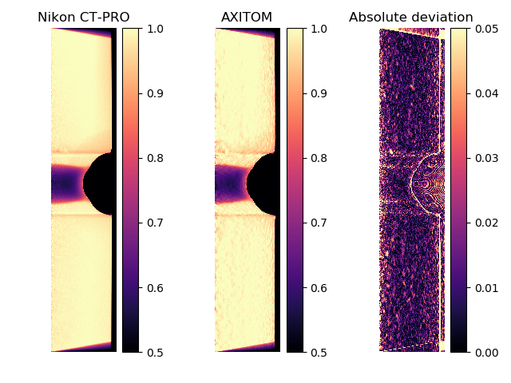

.. AXITOM documentation master file, created by
   sphinx-quickstart on Tue Jun 25 21:12:55 2019.
   You can adapt this file completely to your liking, but it should at least
   contain the root `toctree` directive.

Comparison to NIKON CT-PRO
==========================
As a verification, the results from the FDK algorithm are compared to results obtained from NIKON CT-PRO.
An axis-symmetric tensile specimen is used in this study.

We do this by first acquiring a full dataset (3142 projections) and reconstruct the tomogram
using the proprietary software NIKON CT-PRO. As the tomogram is axis-symmetric along the centre axis
of the specimen, we reslice the tomogram for all R-Z planes and compute the average. This slice is then considered as the reference slice and is our target.

We then pick a single radiogram from the same dataset, filter the radiogram using a median low pass filter,
and reconstruct a tomogram using the FDK algorithm modified for axis-symmetry. 

Comparison of a radial slice
-----------------------------
A comparison of the results from NIKON CT-PRO and AXITOM is shown below. The grey scale values have
been normalized for easier comparison. There is a close correspondence between the results and the absolute deviation
is in the order of 2%, here is considered a satisfactory result.

