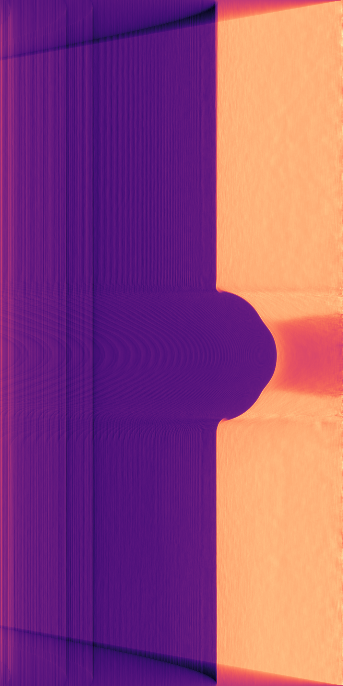

.. AXITOM documentation master file, created by
   sphinx-quickstart on Tue Jun 25 21:12:55 2019.
   You can adapt this file completely to your liking, but it should at least
   contain the root `toctree` directive.

Quick start
==========

Let's now go through the necessary steps for doing reconstruction of a tomogram based on a single image.
First, we need to import the tools::

    import axitom as tom
    from scipy.ndimage.filters import median_filter

The example data can be downloaded from the AXITOM/tests/example_data/ folder. The dataset was collected during tensile testing of a polymer specimen.
Assuming that the example data from the repo is located in root folder, we can make a config object
from the .xtekct file::

    config = tom.config_from_xtekct("radiogram.xtekct")

We now import the projection::

     projection = tom.read_image(r"radiogram.tif", flat_corrected=True)

As we will use a single projection only in this reconstruction, we will reduce the noise content of the projection by
employing a median filter. This works fine since the density gradients within the specimen are relatively small.
You may here choose any filter of your liking::

     projection = median_filter(projection, size=21)

Now, the axis of rotation has to be determined. This is done be binarization of the image into object and background
and determining the center of gravity of the object::

     _, center_offset = tom.object_center_of_rotation(projection, background_internsity=0.9)

The config object has to be updated with the correct values::

     config = config.with_param(center_of_rot=center_offset)

We are now ready to initiate the reconstruction::

     tomo = tom.fdk(projection, config)

The results can then be visualized::

   import matplotlib.pyplot as plt
   plt.title("Radial slice")
   plt.imshow(tomo.transpose(), cmap=plt.cm.magma)

and looks like this:

